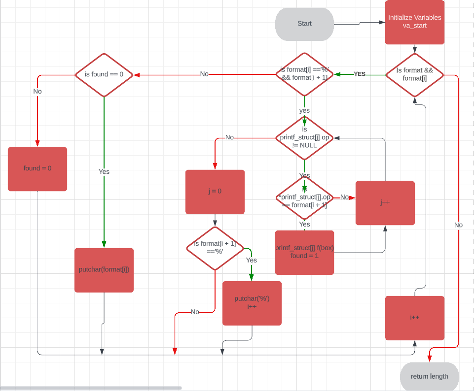

# Printf - C - Project by Manow Duangviangkham & Maria Esmeralda

## Brief Description for Printf:

                Synopsis:
                       "#include <stdio.h>

                        int printf(const char *format, ...);"
          
The printf function sends formatted output to stdout (the standard output, usually your screen).

The format string can contain three types of objects:

Ordinary characters, which are simply copied to the output,
Conversion specifications, each of which results in fetching zero or more arguments,
Escape sequences like \n for newline, \t for tab, etc.
The arguments following the format string are formatted and printed according to the format string.

The format string consists of a sequence of directives which describe how to format and print the arguments of the printf call. A directive begins with a % and ends with a conversion character. For example, %s expects a string argument and %d expects an integer argument.

Here are some examples of conversion characters:

%d or %i: Integer
%f: Decimal floating point
%s: String of characters
%c: Character
RETURN VALUE

Upon successful return, these functions return the number of characters printed (excluding the null byte used to end output to strings).

If an output error is encountered, a negative value is returned.
